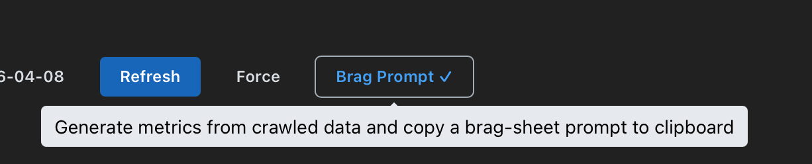

# BragBot

<p align="center">
  
</p>

Your software engineering hype machine — because "I've been busy" isn't a performance review. Crawls your GitHub, Jira & Confluence and turns it into receipts.

> [!NOTE]
> This entire app was 100% vibe coded. Every line of code, every component, every crawl pipeline — all generated through AI-assisted development. No hand-written code.

Built with [Electrobun](https://electrobun.dev) + React + Recharts.

## What it does

BragBot crawls your engineering activity across GitHub, Jira, and Confluence, then generates a structured export you can feed to any AI to produce an evidence-based brag sheet for performance reviews.

It gives you:

- **GitHub**: PRs authored/reviewed, lines changed, review turnaround, collaboration patterns, initiative clusters
- **Jira**: Issues completed, story points, status breakdowns, sprint velocity
- **Confluence**: RFCs, design docs, ADRs, knowledge-sharing pages, comment engagement
- **Brag Prompt**: One-click export with a tuned prompt that produces review-ready accomplishment bullets

Everything runs locally. Your data never leaves your machine.

<!-- INSERT SCREENSHOT OF THE FULL GITHUB DASHBOARD HERE -->

## Getting started

### Install

Download the latest `.dmg` from [Releases](https://github.com/AlbinOS/bragbot/releases), open it, and drag BragBot to your Applications folder.

Since the app is not code-signed, macOS will block it on first launch. Run this once:

```bash
xattr -cr /Applications/BragBot.app
```

### Connect GitHub

You have two options:

1. **Personal Access Token** — create a [classic token](https://github.com/settings/tokens/new?scopes=repo,read:org&description=BragBot) with `repo` and `read:org` scopes
2. **GitHub CLI** — if you already have `gh` installed and authenticated, BragBot detects it automatically

### Connect Atlassian (optional)

Switch to the Jira tab and enter your Atlassian email, site (e.g. `yourcompany.atlassian.net`), and an [API token](https://id.atlassian.com/manage-profile/security/api-tokens). This is shared between Jira and Confluence.

### Crawl your data

1. Select an org and date range
2. Click **Refresh** to crawl (or **Force** to re-crawl from scratch)
3. Each tab (GitHub, Jira, Confluence) crawls independently

## Dashboards

### GitHub

PR activity, lines added/removed, review turnaround, monthly trends, repo breakdown, and a scatter plot of PR size vs merge time.

### Jira

Issues by status, type, and priority. Story points over time. Sprint-level breakdown.

### Confluence

Pages authored by category (RFC, design doc, ADR, knowledge sharing), top spaces, comment engagement, and monthly activity.

## Brag Prompt

Click **Brag Prompt 📋** to export your data and copy a tuned prompt to your clipboard.



The export writes these files to `~/Library/Application Support/BragBot/data/`:

| File                      | Description                                                 |
| ------------------------- | ----------------------------------------------------------- |
| `derived-metrics.json`    | Pre-computed metrics (authoritative numbers)                |
| `initiatives.json`        | Initiative clusters, notable singletons, and role alignment |
| `ai-context.md`           | Full PR/Jira evidence with derived metrics summary          |
| `confluence-derived.json` | Confluence threads with linked initiatives and role signals |

Paste the prompt into ChatGPT, Claude, or any AI tool. The agent will read the exported files and produce:

- 6-8 accomplishment bullets in review-ready language
- Major initiatives grouped by theme
- Key metrics with interpretation
- Collaboration and mentorship signals
- Design, documentation, and technical influence
- Growth areas and missing context

### Enrich with context files (optional)

> [!TIP]
> For best results, provide at least `role.md` and `goals.md`. Without them, the agent generates generic accomplishment bullets instead of aligning to your actual role expectations and objectives.

Drop these files into `~/Library/Application Support/BragBot/data/context/` to improve the output:

| File             | What to put in it                                                             | What it does                                                                   |
| ---------------- | ----------------------------------------------------------------------------- | ------------------------------------------------------------------------------ |
| `role.md`        | Your current role description from your company's engineering ladder          | Aligns accomplishments to your actual role expectations                        |
| `role_target.md` | The next role you're targeting (e.g. Senior II, Staff)                        | Identifies promotion signals in your work                                      |
| `goals.md`       | Your annual goals, OKRs, or roadmap commitments                               | Maps your activity to stated objectives                                        |
| `notes.md`       | Impact notes the data can't show — outcomes, business context, invisible work | Fills the gap between what's in Git/Jira/Confluence and what actually mattered |

## Development

```bash
cd app
bun install
bun run dev
```

## Building

```bash
cd app
npx electrobun build --env=stable
# Output: app/artifacts/stable-macos-arm64-BragBot.dmg
```

## Releases

Releases are automated via [release-please](https://github.com/googleapis/release-please). Use [conventional commits](https://www.conventionalcommits.org/):

- `feat: ...` → minor version bump
- `fix: ...` → patch version bump
- `chore:`, `ci:`, `docs:` → no release

A release PR is auto-created/updated on push to main. Merging it triggers a build and GitHub Release with the `.dmg`.

## License

[MIT](LICENSE)
